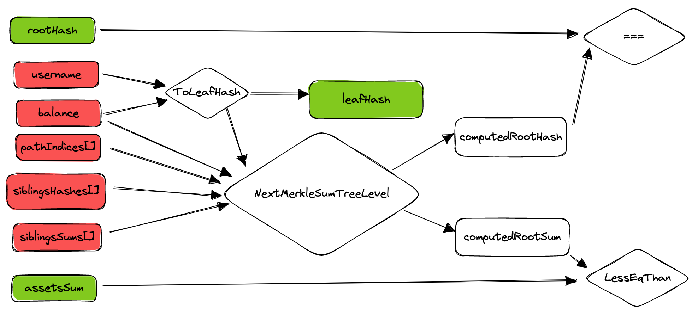

# Proof of Solvency - prover

zkSNARK proving system for Proof Of Solvency.

The zkSNARK proving system consists in a circuit, written in circom, that enforces the rules that the Exchange must abide by when generating a Proof Of Solvency for a specific user. 

The circuit checks that: 
	- A user-balance entry has been included in the Merkle Sum Tree
    - The computation of the sum going from the user's entry to the root has been performed correctly
	- No sum overflow happened during the computation
	- The total of the entries in the tree (namely the total liabilities of an exchange) is equal or less than the total sum of the assets of the exchange

The prover relies on [TS-Merkle-Sum-Tree Library](https://github.com/pan-y-tomate/ts-merkle-sum-tree) for the merkle Sum tree operations.

## Circuit Design 

| Input                          | Description              | Public or Private
| -----------                    | -----------          |  ----------
| rootHash                      | Root Hash of the Merkle Sum Tree committed by the exchange              | Public
| targetSum             | The total assets that the Exchange claims to have   | Public
| leafHash     | The hash of the leaf `H(username, balance)` that contains the data of the user to which the proof is being generated for| Public
| leafSum    | The balance of the user to which the proof is being generater for                 | Public
| pathIndices[nLevels]               | A bit array that contains the path to the user leaf inside the Merkle Sum Tree              | Private
| siblingHashes[nLevels]                | Array of hashes of the siblings of the user leaf                | Private
| siblingsSums[nLevels] | Array of sum-balances of the siblings of the user leaf                 | Private

The nextLevel component recursively computes the current `hash` (for the first level it is the `leafHash`), the current `sum` (for the first level it is the `leafSum`), the current `siblingHash` and the current `siblingSum`. The output of the nextLevel component are the `nextHash` and the `nextSum`. These are calculated as follows:

- `nextHash = H(hash, sum, siblingHash, siblingSum)` if the pathIndex is 0, where H is the poseidon hash function
- `nextHash = H(siblingHash, siblingSum, hash, sum)` if the pathIndex is 1, where H is the poseidon hash function
- `nextSum = sum + siblingSum`

After the last level is being computed, the circuit checks that the `nextHash` is equal to the `rootHash` and that the `nextSum` is lessOrEqual to the `targetSum`.



## Checks to be executed outside the circuit

A proof generated using the circuit, even if verified, doesn't ensure that the prover is solvent. Further checks must be on the public inputs of the circuit to ensure that the prover is solvent. These checks are:

- The `rootHash` must be the root hash of the Merkle Sum Tree committed by the exchange on a Public Bulletin Board
- The `targetSum` must be the total assets of the exchange. The way in which the exchange generates its proof of assets is out of the scope of this project.
- The `leafHash` must be the hash of the leaf `H(username, balance)` that contains the data of the user to which the proof is being generated for
- The `leafSum` must be the balance of the user to which the proof is being generater for

## Scripts

In order to compile the circuit, execute the trusted setup, generate the proof (and verify it) run from the root directory:

```bash
npm run build
```

The script will:

- Download the trusted [Powers Of Tau](https://github.com/iden3/snarkjs#7-prepare-phase-2) setup generated from the Hermez Community
- Compile the circuit 
- Generate a witness based on a pre generated sample input. In order to generate other inputs you can use this program: 

	```javascript

	const { IncrementalMerkleSumTree } = require("ts-merkle-sum-tree")

	...

	proof = tree.createProofWithTargetSum(5, BigInt(125))

	inputToCircuit = JSON.strigify(proof)

	```

- Generate the proof based on the witness
- Verify the proof

## Test

To run the tests, run the following command:

```bash
npm run test
```

## Benchmarks

All benchmarks are run on a Macbook Air M1, 2020 AWS, 8GB memory.

|   |pos prover|
|---|---|
|Constraints                          |13148 |
|Circuit compilation                  |1s    |
|Witness generation                   |1s     |
|Plonk Set-up time   				  |30s     |
|Proving key size                     |530 MB    |
|Proving time                         |90s      |
|Proof verification time              |1s      |
