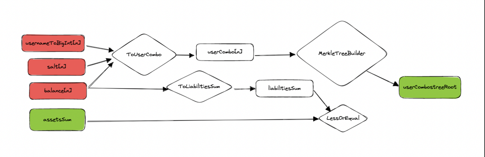

# pyt-circuits 

This branch contains an alternative approach to the main pyt-circuits implementation. 

The exchange generates the Proof of Solvency inside a zkSNARK. The SNARK takes the user entries `usernameToBigInt`,  `salt` and `balance` together with the `targetSum` (the total assets owned by the exchange) as inputs and perform the following operations: 

- Perform the posiedon hash on each entry to get the `userCombo`
- Build a Merkle Tree starting from the `userCombos` and compute the `userComboTreeRoot`
- Sum together all the `balance` to get to the `aggregatedSum` of users’ balances
- Verify that `targetSum` is greater or equal than `aggregatedSum`
- Output the `userComboTreeRoot`

This circuit is part of a different user flow where the exchange only need to generate a proof of solvency once (not an individual proof for each user). The user can simply verify it by checking that their `userCombo` is included in the `userComboTree` (publicly available, for example on IPFS) in order to verify that they have been included in the liabilities computation. The main problem with this approach is that the circuit needs to build the entire `userComboTree` which is highly inefficient.

A similar approach is used by [Maci](https://github.com/privacy-scaling-explorations/maci) and it would be interested to understand how they seek to solve this problem.