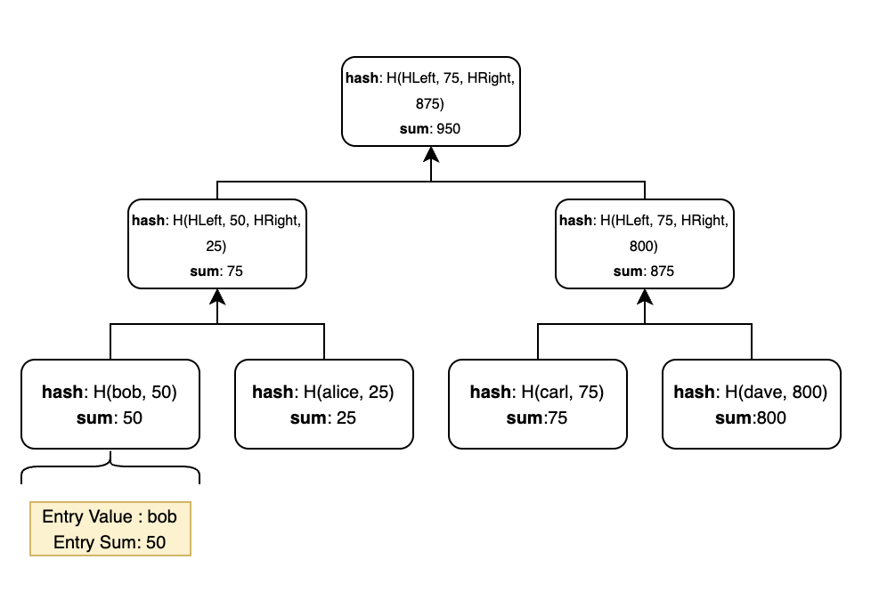

# TS Merkle Sum Tree

**This package is a fork of [ZK-KIT](https://github.com/privacy-scaling-explorations/zk-kit)**

## What is a Merkle Sum Tree?

A Merkle Sum Tree is a binary Merkle Tree with the following properties:

- Each entry of a Merkle Sum Tree is a pair of a value and a sum. 
- Each Leaf Node contains a hash and a sum. The hash is equal to H(value, sum). The sum is equal to the sum itself.
- Each Middle Node contains a hash and a sum. The hash is equal to H(LeftChild.hash, LeftChild.sum, RightChild.hash, RightChild.sum). The sum is equal to the sum of the sums of its children.
- The Root Node represents the committed state of the Tree and contains the sum of all the entries' sums.

<div align="center">

</div>
<br>

## Install 

```npm install ts-merkle-sum-tree``` 

## APIs

\# **new IncrementalMerkleSumTree**(hash: _HashFunction_, depth: _number_): _IncrementalMerkleSumTree_

```typescript
import { IncrementalMerkleSumTree } from "ts-merkle-sum-tree"
import { poseidon } from "circomlibjs" // v0.0.8

const tree = new IncrementalMerkleSumTree(poseidon, 16) // Binary tree with 16 levels and poseidon hash function
```

\# **insert**(entryValue: _number_, entrySum: _number_)

```typescript
tree.insert(BigInt(1), BigInt(25))
```

\# **update**(index: _number_, newEntryValue: _number_, newEntrySum: _number_)

```typescript
tree.update(0, BigInt(2), BigInt(50))
```

\# **delete**(index: _number_)

```typescript
tree.delete(0)
```

\# **getTreeSum** 

```typescript
tree.root.sum 
```

\# **indexOf**(entryValue: _number_, entrySum: _number_): _number_

```typescript
const index = tree.indexOf(BigInt(2), BigInt(50)) // 0
```

\# **createProof**(index: _number_): _Proof_

```typescript
const proof = tree.createProof(0)
```

\# **verifyProof**(proof: _Proof_): _boolean_

```typescript
console.log(tree.verifyProof(proof)) // true
```

## Code Quality and Formatting

Run ESLint to analyze the code and catch bugs:

```npm run lint```

Run Prettier to check formatting rules and to fix them:

```npm run format```

## Testing

```npm run test```

